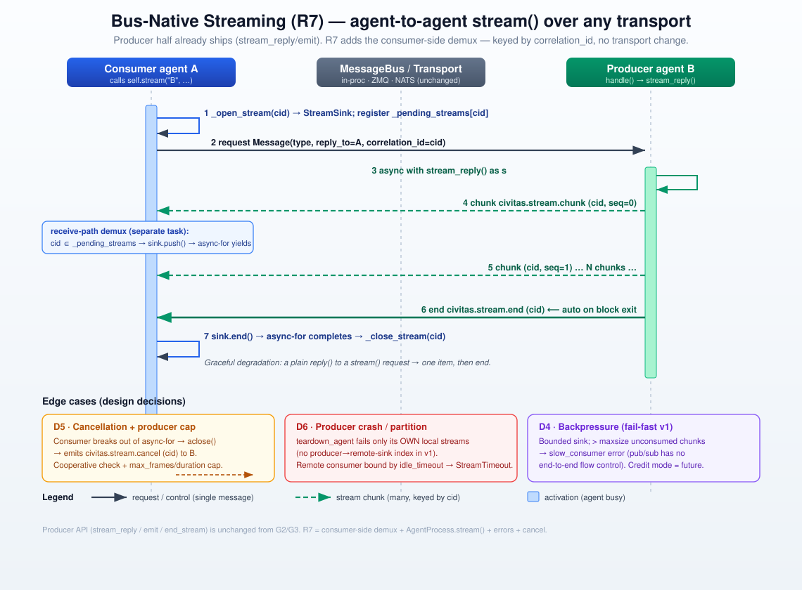

# Bus-Native Streaming (v0.7.x · R7)

**Status:** ✅ Approved **v2** — Oracle-reviewed; maintainer signed off 2026-07-05 ("go with recommendations": A·a + B·field + C·cap). Plan → Momus → implementation next.
**Source:** [GH #15](https://github.com/civitas-io/python-civitas/issues/15); [`gateway-streaming.md`](gateway-streaming.md) §D1 (Option B); [`milestones.md`](../milestones.md) v0.7.0 R7 (stretch → slipped to a follow-up)
**Builds on:** G2/G3 gateway streaming (shipped), R1 (`bus.teardown_agent`, non-blocking lifecycle)

> **v2 changelog (Oracle review):** The *strategy* survives — **D1 (no transport change) is sound on all three transports**; using `self.name` as `reply_to` avoids the ephemeral-reply-lifetime trap of `request()`. But the *integration* was wrong: **D2's in-`_run` demux self-deadlocks** the documented consume-in-`handle()` pattern (the single loop task parks in `handle()`, so the demux that feeds the sink can never run). Rewritten around **receive-path demux** (D2), which also removes head-of-line blocking. Further fixes: **D6 downgraded** (`teardown_agent` can't reach a remote consumer's sink → `idle_timeout` is the real peer-loss bound); **`seq` load-bearing, now required** via a `Message.seq` field (transport drops + JetStream redelivery); **producer-side cap** (cancel is best-effort); **sender verification** on demux (cids aren't secret); **`_pending_streams` cleanup**; **`civitas.stream.*` enforced** as reserved.



---

## 1. Problem

Streaming is **gateway-mediated only**. An external client can receive incremental output (SSE / WebSocket / gRPC server-streaming, G2/G3), but **one agent cannot stream to another agent over the bus**. `ask()` is single-shot: the caller blocks until one reply. There is no `AsyncIterator` reply path between agents.

Concrete cost: the LangGraph / OpenAI adapters (civitas-contrib) already have token streams from their frameworks but must **buffer to a single reply** because the bus cannot carry chunks agent-to-agent ([`adapters.md`](../adapters.md) L112, L222). Any orchestrator→worker pipeline that wants live partial output is blocked.

## 2. Current behavior (ground truth)

The **producer half already exists and is proven** — the gateway relies on it across every transport.

- **Producer API (public, shipped)** — `process.py`:
  - `emit(payload)` (`887-896`), `end_stream()` (`898-902`), `stream_reply()` async-CM (`904-926`), `StreamReply.send()` (`155-169`).
  - `_emit_stream(message, payload, stream_type)` (`928-945`): builds a `Message(type=civitas.stream.{chunk,end,error}, recipient=message.reply_to or message.sender, correlation_id=message.correlation_id)` and `self._bus.route(out)`. **Chunks are ordinary bus messages** routed by name + correlation_id.
  - Constants (`24-26`): `_STREAM_CHUNK/_END/_ERROR = "civitas.stream.{chunk,end,error}"`.
- **Consumer half (gateway-private)** — the missing piece for agents:
  - `StreamSink` (`gateway/dispatch.py`:`72-140`): bounded buffer; `push()` fails with `slow_consumer` once `_pending >= maxsize` (comment: *"a fire-and-forget bus gives us no way to push backpressure onto the producing agent"*); `drain(idle_timeout, max_duration)` → `AsyncIterator`, raises `_StreamClosed` on error/timeout.
  - `HTTPGateway._open_stream/_close_stream` (`gateway/core.py`:`285-291`), `_send_stream_request` (`293-316`, sets `reply_to=self.name`), and `handle()` (`318-333`) which **demuxes chunk/end/error by `correlation_id`** into the matching sink.
  - `GatewayDispatcher.stream()` (`gateway/dispatch.py`:`235-266`).
- **Receive path vs loop** — `bus.setup_agent()` (`bus.py:51-63`) subscribes the agent's message callback, which runs in the **transport-receiver task** (ZMQ `_receiver_loop`, NATS callback) or the **producer's task** (in-proc direct `await handler`); it enqueues onto `Mailbox`. Separately, `process.py._run` (`~1129-1170`) pulls the mailbox in a **single sequential loop task**, early-`continue`s for `_agency.*`/`civitas.dynamic.terminated`, then `self._current_message = message; await self._dispatch(message)` → `handle()` (`1229`). **These are different tasks** — the crux of D2.
- **Transport** — `transport/__init__.py`: `request()` is **single-shot** (send + await one reply, then the ephemeral `_reply.{uuid}` address is torn down). `publish()` is fire-and-forget; `subscribe(address, handler)` is the receive path. **No transport supports multi-frame replies** — but the gateway proves multi-chunk delivery to a *named, persistent* recipient already works everywhere.

**Four gateway assumptions that do NOT generalize** (Oracle): it (1) drains in a *separate* uvicorn task from its demux, (2) carries *no business traffic*, (3) is *never SUSPENDED*, (4) is *not restarted* mid-stream. A general agent violates all four — so R7 cannot just copy the gateway's in-`handle()` demux; it must intercept on the receive path (D2) and add cancel/peer-loss/ordering semantics (D5–D7).

## 3. Design approach — generalize the consumer half; demux on the receive path

`AgentProcess.stream(recipient, payload, …)` registers a `StreamSink` under a fresh `correlation_id` in a per-agent `_pending_streams` map, sends an ordinary request with `reply_to=self.name`, and yields chunks as they arrive. **Incoming `civitas.stream.*` frames are intercepted in the receive path — the message callback wired by `bus.setup_agent` — before they reach the mailbox or `handle()`.** Because that callback runs in a *different task* than the consumer's `handle()`, a `handle()` doing `async for chunk in self.stream(...)` is fed concurrently (no deadlock), and chunks never contend with business traffic in the mailbox (no head-of-line blocking). The **producer side is unchanged**.

This retires Option B (§D1): the "ZMQ/NATS multi-reply semantics are hard" concern assumed changing `Transport.request()`. We reuse `publish()` + a named reply address — the path the gateway already runs on ZMQ/NATS.

What's missing to make it work end-to-end:
1. A **receive-path demux** (today it lives only in the gateway's `handle()`, in the wrong task).
2. A shared, non-gateway home for `StreamSink` + stream errors.
3. **Cancellation, peer-loss, ordering, sender-verification** semantics an edge gateway never needed.

## 4. Decisions

| # | Decision | Rationale |
|---|----------|-----------|
| **D1** ★ | **No transport change** — `publish()` + `reply_to=self.name` + `correlation_id` demux (Option A generalized), not `Transport.stream()` (Option B). *Oracle-confirmed sound on in-proc/ZMQ/NATS.* | `self.name` is the consumer's permanent subscription → sidesteps `request()`'s ephemeral-reply teardown; keeps the 5-method transport contract. |
| **D2** ★⚠️ | **Demux on the RECEIVE PATH**, not in `_run`. Intercept `civitas.stream.*` (and a pending-cid reply) in the `bus.setup_agent` message callback (runs in the transport-receiver / producer task), route to the `_pending_streams[cid]` sink, and **do not enqueue to the mailbox**. | **Fixes the self-deadlock**: `_run` is a single task that parks in `handle()`; a demux there can't feed a sink `handle()` is awaiting. Receive-path demux runs in a different task; also bypasses the mailbox → no head-of-line blocking. |
| **D3** | **API:** `async def stream(self, recipient, payload, message_type="message", *, timeout, idle_timeout, max_duration, maxsize) -> AsyncIterator[dict[str, Any]]`. Producer API **unchanged**. Gap detection internal (raises typed error). | One new public method; yields payload dict (ergonomic, matches gateway `drain()`). |
| **D4** | **Backpressure = fail-fast bounded sink**; overflow → `SlowConsumerError`. In-proc *could* block for free (bounded mailbox) but we choose one uniform rule over per-transport asymmetry. | Fire-and-forget pub/sub has no end-to-end flow control; **drop-oldest would corrupt token streams**, so fail-fast is the correct minimum, not a compromise. |
| **D5** ⚠️ | **Cancellation = cooperative + producer cap (C).** Consumer abandoning the iterator emits `civitas.stream.cancel (cid)`; `stream_reply()`/`emit()` check a cancelled flag and stop. **Additionally** the producer stream carries a `max_frames`/`max_duration` cap so a lost cancel or dead consumer can't run it forever. | Cancel is best-effort over pub/sub and only bounds the *consumer*; the cap bounds the *producer*. Composes with R5 quotas. |
| **D6** ⚠️ | **Peer-loss bound = `idle_timeout`/`max_duration` (A·a).** `teardown_agent` operates only on the torn-down agent's own mailbox — it has **no producer→consumer-sink index**, so it can't synchronously fail a *remote* consumer's sink. v1 relies on the consumer's idle/max-duration bounds; on `on_stop`/teardown an agent fails its **own** local pending streams. *(Immediate `StreamInterrupted` via a bidirectional index deferred — §8-A.)* | Honest about the mechanism; no false "immediate interrupt" promise; still bounded (no hang). |
| **D7** ⚠️ | **`seq` is REQUIRED (B):** producer stamps a monotonic per-stream `seq` on an envelope field `Message.seq: int \| None`; consumer detects **gaps (drop), duplicates & reorder (JetStream at-least-once)** and fails the stream with a typed `StreamError` on violation (v1). | Not "insurance": ZMQ drops at HWM, NATS drops on slow consumers, JetStream redelivers. Envelope field (not `__seq__` payload key) avoids mutating the yielded dict; `from_dict` already filters unknown keys → back-compat both ways. |
| **D8** | **Graceful degradation:** intercept by `correlation_id` — a producer answering with a plain `reply()` yields **one item, then end**. | A streaming caller against a non-streaming handler must not hang. |
| **D9** | **Shared home + public errors:** move `StreamSink`/`_StreamClosed` to `civitas/streaming.py`; export `StreamError → SlowConsumerError, StreamInterrupted, StreamTimeout` from `civitas.errors`. Gateway imports the shared sink (behavior-preserving, guarded by G2/G3 suites). | One sink shared by agents + gateway; typed errors for consumers. |
| **D10** | **Leave G2/G3 behavior unchanged** (#15 non-goal). | De-risks R7. |
| **D11** ⚠️ | **Sender verification:** the agent demux accepts a chunk only if `message.sender ==` the stream request's recipient (the expected producer); mismatches are dropped. | cids are `_uuid7` (timestamp+random, **not secret**); without this any agent knowing a cid + the consumer name can inject chunks. (Gateway edge stays as-is.) |
| **D12** | **`_pending_streams` cleanup guaranteed** in a `finally` in `stream()` (normal end, exception, `break`/`aclose`, and `on_error` RETRY that re-runs `handle()` with a new cid). | Retry/restart otherwise strands the old sink while the producer keeps emitting. |
| **D13** | **Enforce reserved types:** validate `civitas.stream.*` at the send boundary like `_agency.*` (`bus.py:104-110`), so application code can't spoof stream frames. | Previously *claimed* reserved but only `_agency.*` was enforced. |

★ pivotal · ⚠️ needs careful review

## 5. Backpressure — prior art & position

Fire-and-forget pub/sub cannot provide end-to-end backpressure without a side-channel:
- **core NATS**: no flow control; server marks slow consumers and **disconnects**, clients **drop** on local buffer overflow.
- **ZeroMQ**: PUB/SUB **drops** at the high-water mark; only PUSH/PULL **blocks** at HWM (blunt, can't tell "slow consumer" from "slow link").
- **gRPC/HTTP-2** has window-based flow control but the window is small and greedy — the community consensus is that **application-level demand signaling** is still required.
- **Credit/demand-based** is the "correct" streaming answer — GenStage/Flow (`min_demand`/`max_demand`), Reactive Streams `request(n)`, Akka Streams windowed demand, NATS JetStream pull consumers (`MaxAckPending`). All add a **backward demand channel** and per-message round-trips.

**Position:** v1 = **fail-fast bounded buffering** (D4) — honest, matches shipped gateway, zero new round-trips. Two Oracle caveats folded in: (1) **in-process already has free blocking backpressure** via the bounded mailbox — we knowingly trade that for one uniform rule; (2) **the transport can drop chunks before the sink** (ZMQ HWM, NATS), so `maxsize` is not the only loss point → this is *why* `seq` (D7) is mandatory. Credit-based demand (`civitas.stream.credit(n)`, GenStage-style windowing) is a reserved-namespace **future** (Q5).

## 6. Threat / abuse model

- **Cross-stream injection** → **D11 sender check**: cids are `_uuid7` (timestamp+random, *not secret*), so match `sender == expected producer`, not cid alone. M4 signing proves identity; the sender check adds authorization.
- **Runaway producer** → bounded by `maxsize`, `idle_timeout`, `max_duration`, cooperative cancel **and the D5 producer cap**; composes with R5 quotas.
- **Reserved types** → **D13** enforces `civitas.stream.*` at the send boundary (previously only `_agency.*` was validated).
- **Signing:** stream frames are ordinary messages → transport-level Ed25519 signing (M4) applies unchanged.

## 7. API sketch

```python
# Consumer (NEW) — safe to consume directly inside handle() (receive-path demux, D2)
async def handle(self, message: Message) -> Message | None:
    async for chunk in self.stream("summarizer", {"doc": message.payload["doc"]}):
        await self.emit(chunk)          # re-stream onward, or accumulate
    return self.reply({"ok": True})

# Producer (UNCHANGED — already shipped)
async def handle(self, message: Message) -> None:
    async with self.stream_reply() as s:   # producer cap enforced under the hood (D5)
        async for token in self.llm_stream(...):
            await s.send({"delta": token})
```

## 8. Resolved decisions (maintainer sign-off — 2026-07-05: "go with recommendations")

Oracle agreed with the v1 leans on **Q2** (defer producer opt-in; D8 only), **Q4** (`AsyncIterator[dict]`), **Q5** (defer credit; reserve `civitas.stream.credit`), **Q6** (share `StreamSink` now, guard with G2/G3 suites).

- ✅ **A — D6 scope = (a):** `idle_timeout`/`max_duration` is the peer-loss bound for v1; immediate `StreamInterrupted` via a bidirectional producer→sink index is deferred.
- ✅ **B — `seq` placement = `Message.seq: int | None` envelope field** (not a `__seq__` payload key), so the yielded dict is never mutated; `from_dict` already filters unknown keys → back-compat both directions.
- ✅ **C — producer cap** added: a producer-side `max_frames`/`max_duration` bound so a lost cancel or dead consumer can't run the producer forever.

## 9. Test plan (outline)

- **Deadlock regression (the BLOCKER):** consume a stream *inside* `handle()` → completes, does **not** raise `StreamTimeout`.
- **Head-of-line:** a high-volume stream interleaved with normal `ask()` traffic to the same agent → business traffic is not starved (receive-path demux bypasses the mailbox).
- **All 3 transports (parametrized):** N chunks + end; `SlowConsumerError` on overflow; `idle_timeout`/`max_duration`; error terminator → `StreamError`; graceful degradation (plain `reply()` → one item); `seq` gap/dupe/reorder → typed error (JetStream redelivery case explicit).
- **Sender verification:** a chunk with a foreign `sender` on a valid cid is dropped (D11).
- **Cancellation + cap:** consumer `break`s → producer receives `civitas.stream.cancel` and stops; lost-cancel → producer stops at its cap (D5).
- **Supervision:** producer crash → consumer bounded by `idle_timeout` (D6·a); consumer restart/RETRY → old `_pending_streams` entry cleaned up (D12), no leak.
- **Reserved types:** app sending `civitas.stream.*` is rejected (D13).
- **Gateway parity (D9/D10):** existing G2/G3 SSE/WS/gRPC suites stay green. Full suite green; coverage ≥ 85%.

## 10. Implementer checklist (once A/B/C signed off)

- `civitas/streaming.py`: move `StreamSink` + errors; add `seq` gap/dupe/reorder detection.
- `civitas/errors.py`: `StreamError`, `SlowConsumerError`, `StreamInterrupted`, `StreamTimeout`.
- `bus.py`: **receive-path demux hook** in `setup_agent`'s callback (route `civitas.stream.*`/pending-cid to the agent's sink registry before mailbox enqueue); enforce reserved `civitas.stream.*` at the send boundary (D13).
- `process.py`: `_pending_streams` map + `stream()` (register-before-send; `finally` cleanup D12; sender check D11; emit `civitas.stream.cancel` on close); producer cap in `stream_reply`/`emit` (D5); fail local pending streams on `on_stop`.
- `messages.py`: `Message.seq: int | None` (+ `to_dict`/`from_dict`); `civitas.stream.cancel` (+ reserved `civitas.stream.credit`) in the stream-type set.
- `gateway/`: import shared `StreamSink` (D9); no behavior change (D10).
- `civitas/__init__.py`: export new errors; `CHANGELOG.md` `[Unreleased]`; AGENTS.md reserved-type note; `docs/streaming.md` + link from `transports.md`.

## 11. References

- GH #15; [`gateway-streaming.md`](gateway-streaming.md) §D1 (Option A/B fork), D6 (`stream_queue_maxsize`).
- Prior art: GenStage/Flow, Reactive Streams `request(n)`, Akka Streams, gRPC flow-control, NATS JetStream `MaxAckPending`, ZeroMQ HWM.
- Reuses: R1 `bus.teardown_agent`; shipped `stream_reply`/`emit` producer path.
