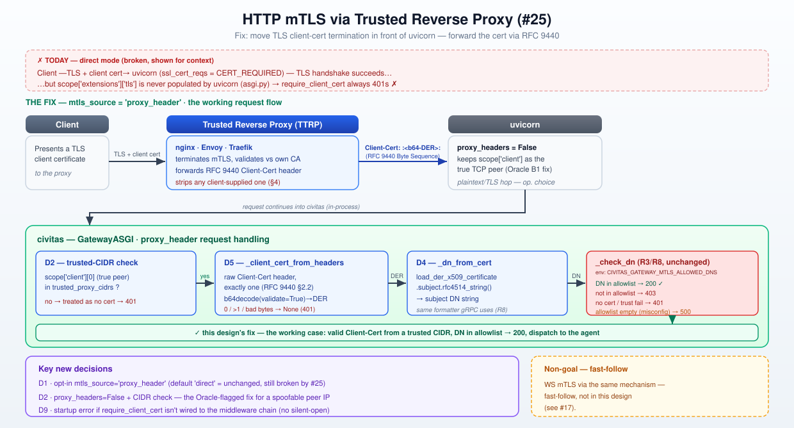

# HTTP mTLS via Trusted Reverse Proxy (#25)

**Status:** ✅ Approved v2 — Oracle-reviewed, two blockers + five should-fix items folded in;
maintainer signed off 2026-07-06 on all three open calls (§10: Q1 hard error, Q2 full nginx+Envoy+Traefik
examples, Q3 diagram). Plan → Momus → implementation next.
**Source:** [GH #25](https://github.com/civitas-io/python-civitas/issues/25); `docs/design/gateway-auth.md` (R3, v0.7.0); `docs/design/gateway-ws-grpc-auth.md` (R8, v0.7.2)
**Builds on:** R3 mTLS DN-allowlist authorization (`civitas/gateway/mtls.py`), R8's shared
`_check_dn`/`_dn_from_pem` primitives (`civitas/gateway/mtls.py`, extracted for exactly this reuse).

> **v2 changelog (Oracle review, folded in):**
> - 🔴→✅ **B1 — D2's trust check read an untrustworthy peer IP.** `scope["client"]` is rewritten by
>   uvicorn's `ProxyHeadersMiddleware` from the client-supplied `X-Forwarded-For` header whenever the
>   immediate peer is in `forwarded_allow_ips` (uvicorn defaults: `proxy_headers=True`,
>   `forwarded_allow_ips="127.0.0.1"` — civitas's `uvicorn.Config` call, `core.py:201-210`, overrides
>   neither). In the most common topology (a co-located sidecar proxy on loopback that forwards XFF —
>   nginx/Envoy/Traefik all do this by default), `scope["client"]` silently becomes the *external
>   client's* IP, not the proxy's — the CIDR check then compares the wrong value and either rejects
>   every legitimate client (operator put the proxy's CIDR in `trusted_proxy_cidrs`) or, if widened,
>   lets any client landing inside that CIDR self-attest a certificate via XFF — the exact bypass D2
>   exists to prevent. **Fix: civitas now explicitly owns `proxy_headers=False` on uvicorn's config
>   whenever `mtls_source="proxy_header"`**, so `scope["client"]` is always the true TCP peer,
>   regardless of uvicorn's defaults or a `$FORWARDED_ALLOW_IPS` env var. Trade-off made explicit in
>   D2: `client_ip` (used by rate-limiting/logging) becomes the *proxy's* IP in this mode — recovering
>   the real client IP from XFF for those consumers is a documented non-goal (§8), not an oversight.
> - 🔴→✅ **B2 — D5's function signature couldn't enforce D2's check.** The v1 extractor took only
>   `headers: dict[str, str]` — no peer IP, no `trusted_proxy_cidrs` — so an implementer following the
>   doc literally would ship an extractor with *no* trust check at all. **Fix: `_client_cert_from_headers`
>   now takes the full ASGI `scope` (mirroring `_client_cert_from_scope`'s existing signature) plus
>   `trusted_proxy_cidrs`**, checks the peer IP first (cheap, no parsing), and reads the *raw*
>   `scope["headers"]` list rather than an already-flattened dict — which also fixes the singleton
>   check (next point).
> - 🟡→✅ **S1 (YAML plumbing):** `mtls_source`/`trusted_proxy_cidrs` added to `GatewayAuthConfig`
>   (`security/config.py`) and wired through `runtime.py`'s topology loader, mirroring `tls_ca_cert`/
>   `client_cert_mode`'s existing YAML path. (Note: `grpc_enabled`/`ws_routes` are **not yet** wired
>   through YAML at all — a pre-existing gap predating this design, out of scope here.)
> - 🟡→✅ **S2 (RFC 9440 parsing robustness):** `base64.b64decode(s, validate=True)` (not the lenient
>   default, which silently drops non-alphabet characters); explicit `:`-prefix/suffix check instead
>   of `.strip(":")` (which would also strip repeated colons); reading the raw header list (from the
>   B2 fix) lets the extractor actually enforce RFC 9440's "MUST NOT... occur multiple times" —
>   multiple `Client-Cert` occurrences now fail closed exactly like a malformed/absent header, instead
>   of silently asserting an unenforceable claim.
> - 🟡→✅ **S3 (exception discipline + startup dependency check):** the extractor catches only
>   `binascii.Error`/`ValueError` (bad base64 / bad DER) → `None` (never a 500); `cryptography`
>   availability for `proxy_header` mode is now validated **eagerly at `on_start`** (mirroring
>   `JwtVerifier`'s eager-build pattern), so a missing dependency is a loud startup
>   `ConfigurationError`, never silently masked as a per-request 401.
> - 🟡→✅ **S4 (`mtls_source` runtime validation):** added `_MTLS_SOURCES = frozenset({"direct",
>   "proxy_header"})` validated in `__post_init__`, mirroring `_CLIENT_CERT_MODES` — a YAML typo like
>   `"proxy-header"` now fails loudly at config time instead of silently behaving as `"direct"`.
> - 🟡→✅ **S5 (silent-open guard):** a new startup check fires when `mtls_source="proxy_header"` but
>   `civitas.gateway.mtls.require_client_cert` is absent from `_configured_middleware_paths()` — this
>   combination means the header extractor runs but nothing authorizes on it, an open gateway with no
>   signal (the exact R3-M1 failure shape). **Open call for maintainer sign-off: error or warn?** (§10, Q1)
> - 🟢 **N1/N2 folded:** `_dn_from_pem`/`_dn_from_der` now share one guarded `cryptography` import and
>   one `_dn_from_cert(cert) -> str` formatter (single F2 point, single ImportError guard); the
>   speculative `leaf_pem` re-encode is dropped from D5's return shape (`{"dn": ...}` only — add
>   `leaf_pem` if/when a consumer actually needs it, not speculatively).
> - **D3 (field-sharing scope cut) — Oracle-confirmed correct, not changed**, with two additions:
>   the `ConfigurationError` message now names the concrete gRPC consequence and the two-`HTTPGateway`-instances
>   workaround (§4); and an explicit **escalation trigger** is recorded in §8 for when a third
>   `client_cert_mode` consumer tension would justify revisiting a field split, rather than doing it
>   preemptively on two data points.

## 1. Problem

`require_client_cert` (R3, v0.7.0) always rejects requests with `401 client certificate required`
— **even from clients presenting a valid, CA-verified client certificate** — because uvicorn never
populates the ASGI TLS extension (`scope["extensions"]["tls"]`) that `_client_cert_from_scope`
(`asgi.py:111-124`) reads. Confirmed both by upstream evidence (uvicorn PRs #1119/#1842 unmerged,
issue #400 open since 2019, issue #745 declined) and empirically in this repo: a live TLS handshake
against uvicorn with `--ssl-cert-reqs 2` (CERT_REQUIRED) and a valid client cert returns
`{"extension_keys": [], "tls": null}`. The handshake itself succeeds (CERT_REQUIRED would reject an
invalid/missing cert before the app ever runs) — the app-visible data just never arrives.

**Impact:** not an auth bypass (fails closed) — but any deployment enabling `client_cert_mode` +
`require_client_cert` gets zero working clients. The feature has likely never functioned against a
real uvicorn server.

## 2. Current behavior (ground truth)

- `_client_cert_from_scope` (`asgi.py:111-124`) reads `scope["extensions"]["tls"]`; uvicorn leaves
  this empty regardless of TLS configuration.
- `GatewayConfig.client_cert_mode` (`core.py:52`, `_CLIENT_CERT_MODES = {"none", "optional",
  "required"}`) maps to uvicorn's `ssl_cert_reqs` (`core.py:180`, via `_CERT_REQS`) — this part works
  correctly (uvicorn DOES enforce the TLS-layer handshake requirement); only the app-visible cert
  *data* is missing.
- `require_client_cert` (`mtls.py:97-122`) is otherwise correct and unchanged by R8: it calls the
  shared `_check_dn(dn, allowed)` predicate (`mtls.py:51-73`) which raises `_MtlsMisconfigured` /
  `_NoCertificate` / `_Forbidden`, mapped to 500/401/403. **This logic needs zero changes** — the bug
  is entirely upstream, in how `dn` gets populated.
- `_dn_from_pem(pem: bytes) -> str` (`mtls.py:76-94`) — added in R8 specifically so gRPC's DN
  extraction and any future HTTP/WS fix would agree on DN string format "by construction." This is
  the reuse point for this design.
- `GatewayConfig.client_cert_mode` is **also** read by gRPC (`core.py:94-99`, R8/D9-D10) to wire
  `GrpcServer`'s own, independent, working mTLS (`add_secure_port(root_certificates=...,
  require_client_auth=True)` — gRPC reads `context.auth_context()`, not the ASGI scope, so it was
  never affected by this bug). **This shared field is the crux of Decision D3 below.**

## 3. Design approach

Of the three candidates in the GH issue, only one is viable today (see Decisions):

- **Reverse-proxy pattern (chosen):** a TLS-terminating reverse proxy (TTRP) — nginx, Envoy, Traefik,
  or any load balancer that supports client-cert forwarding — sits in front of uvicorn, does the
  actual mTLS handshake, and forwards the verified client certificate to civitas via the
  IETF-standardized [RFC 9440](https://www.rfc-editor.org/rfc/rfc9440.html) `Client-Cert` header (a
  base64-encoded DER certificate, structured-field Byte Sequence syntax: `Client-Cert:
  :<base64-DER>:`). civitas decodes it, extracts the DN via a DER-sibling of the existing
  `_dn_from_pem`, and feeds it into the **unchanged** `_check_dn` predicate — `require_client_cert`
  itself needs zero code changes.
- **Custom uvicorn protocol subclass (rejected):** real-world examples exist (a production patch
  wrapping `h11_impl.RequestResponseCycle.__init__` to read `transport.get_extra_info("ssl_object")`)
  but the upstream maintainer has stated the ASGI TLS extension spec may not be fully implementable,
  and the underlying protocol classes are internal, undocumented, and have already changed shape
  across uvicorn versions — this would be an unbounded, version-pinned maintenance liability for a
  first-party feature.
- **Switch to hypercorn (rejected):** hypercorn does **not** implement the ASGI TLS extension either
  ([hypercorn#62](https://github.com/pgjones/hypercorn/issues/62), open since Aug 2022; even a
  motivated third-party fork attempt was never merged upstream). Switching servers would not fix
  anything and would cost HTTP/3 parity work for no benefit.

This is also the deployment pattern most production ASGI mTLS setups already use in practice —
uvicorn (and most Python ASGI servers) are routinely run behind a TLS-terminating proxy in
production regardless of this bug.

## 4. Decisions

| # | Decision | Rationale |
|---|----------|-----------|
| **D1** ★ | **New opt-in `GatewayConfig.mtls_source: str = "direct"`, validated against `_MTLS_SOURCES = frozenset({"direct", "proxy_header"})` in `__post_init__`** (mirrors `_CLIENT_CERT_MODES`, `core.py:76-80` — a bad value is a loud `ConfigurationError`, never a silent fallback to `"direct"`, S4). `"direct"` is today's behavior (uvicorn does its own TLS client-cert handshake — still broken per #25). `"proxy_header"` trusts an upstream TTRP's RFC 9440 `Client-Cert` header instead. | RFC 9440 §4 mandates producing/consuming these headers be an explicit, default-off opt-in — never inferred from other config. A separate field (not reusing `client_cert_mode`) keeps "does uvicorn itself request a client cert" and "do we trust an upstream proxy's header" as two independently-toggleable, non-conflicting questions. |
| **D2** ★⚠️⟳ | **New `GatewayConfig.trusted_proxy_cidrs: frozenset[str]` — required, non-empty, when `mtls_source="proxy_header"`**, each entry validated eagerly via `ipaddress.ip_network(..., strict=False)` in `__post_init__`. **Oracle B1 fix:** civitas now sets `proxy_headers=False` on the `uvicorn.Config` it builds whenever `mtls_source="proxy_header"` (`core.py`, next to the existing `ssl_cert_reqs=` line), so `scope["client"]` is guaranteed to be the true TCP peer — never rewritten from a client-supplied `X-Forwarded-For` by uvicorn's `ProxyHeadersMiddleware` (which is **on by default**, trusting `127.0.0.1` unless overridden, and would otherwise silently substitute an attacker- or client-influenced address). The peer IP is checked against `trusted_proxy_cidrs` **before** any header parsing is attempted (D5); outside the trusted set, the `Client-Cert` header is **ignored entirely** (treated as absent) — falling through to `require_client_cert`'s existing, unchanged `_NoCertificate` → 401 path. **Trade-off, made explicit:** `GatewayRequest.client_ip` (consumed by rate-limiting/logging) becomes the *proxy's* IP, not the original client's, whenever `mtls_source="proxy_header"` — recovering the real client IP via XFF for those other consumers is a documented non-goal (§8), a decision `proxy_header` mode makes deliberately, not a regression. | RFC 9440 §4: "backend servers MUST only accept the Client-Cert... header fields from a trusted TTRP." A trust check keyed on a value another layer (uvicorn) can rewrite from client-controlled input is not a trust check — Oracle confirmed this is exploitable in the single most common topology (a co-located sidecar proxy that forwards XFF, which nginx/Envoy/Traefik all do by default) and is a silent, topology-dependent bypass, not a hypothetical. Owning `proxy_headers` is the only way to make the CIDR check mean what it claims to mean. |
| **D3** ★⚠️ | **`mtls_source="proxy_header"` requires `client_cert_mode="none"`** (raises `ConfigurationError` otherwise, **Oracle-confirmed correct — kept as-is**). The error message names the concrete consequence: *"client_cert_mode must be 'none' when mtls_source='proxy_header' (HTTP would otherwise demand a direct-TLS client cert AND trust a proxy-forwarded one simultaneously — contradictory). If this gateway also needs grpc_enabled with direct required mTLS, run gRPC on a separate HTTPGateway instance with client_cert_mode='required' and mtls_source left at its default."* | `client_cert_mode` is shared by HTTP (uvicorn `ssl_cert_reqs`) **and** gRPC (R8/D9-D10: `GrpcServer`'s independent `add_secure_port(require_client_auth=...)`) — Oracle confirmed forcing `"none"` is *semantically correct for HTTP itself* (proxy-header and direct-cert-request are contradictory demands on the same surface), not just a validation dodge, and that splitting the field now would be a breaking `GatewayConfig`/YAML-topology change disproportionate to a bug-fix issue. **Escalation trigger recorded for later** (§8): this is the *second* tension on this single field (R8/D9 was the first) — a *third* consumer tension, or real operator demand for divergent same-instance HTTP/gRPC models, should trigger revisiting a field split (or additive `*_client_cert_mode` overrides), not before. |
| **D4** ⟳ | **Single `_dn_from_cert(cert: x509.Certificate) -> str` formatter** (`.subject.rfc4514_string()`), with `_dn_from_pem`/`_dn_from_der` reduced to thin loaders sharing **one** guarded `cryptography` import. RFC 9440 encodes `Client-Cert` as base64 **DER** (not PEM) per [§2.1](https://www.rfc-editor.org/rfc/rfc9440.html#section-2.1) — `x509.load_der_x509_certificate`, not `load_pem_x509_certificate` (gRPC's `auth_context()["x509_pem_cert"]` is PEM; two different wire encodings from two different transports is a real constraint). | Oracle N1: the v1 sketch (two independent siblings each re-implementing the `cryptography` ImportError guard) preserves R8's F2 DN-format guarantee but duplicates the dependency-guard logic. One shared guarded loader + one formatter keeps both the F2 guarantee *and* the guard in exactly one place each. |
| **D5** ⟳ | **`_client_cert_from_headers(scope: dict[str, Any], trusted_cidrs: frozenset[str]) -> dict[str, Any] \| None` in `mtls.py`**, mirroring `_client_cert_from_scope(scope)`'s existing signature (**Oracle B2 fix** — the v1 signature took only a flattened header dict, which structurally cannot perform D2's peer-IP check or detect duplicate headers). Order of operations: (1) extract `scope["client"]`, reject if outside `trusted_cidrs` → `None`; (2) scan the **raw** `scope["headers"]` list (not `asgi.py`'s already-flattened dict, which silently collapses duplicates to the last value) for `client-cert`, requiring exactly one occurrence — zero or more-than-one → `None` (RFC 9440 §2.2: "MUST NOT... occur multiple times"); (3) strip the `:`...`:` Byte-Sequence delimiters via explicit prefix/suffix checks (not `.strip(":")`, which would also eat repeated colons), `base64.b64decode(s, validate=True)` (not the lenient default, which silently discards non-alphabet characters), load DER, extract DN via D4 — any `binascii.Error`/`ValueError` at this stage → `None`. Return shape is `{"dn": ...}` only (Oracle N2: no speculative `leaf_pem` re-encode — add it if/when a consumer needs it). | Matching `_client_cert_from_scope`'s signature means `GatewayASGI._handle_http` just picks one extractor by `config.mtls_source` and passes it the same `scope` either way; everything downstream (`GatewayRequest.client_cert`, `require_client_cert`) stays unaware which mode produced it — R8's D5 "shared predicate, not shared HTTP-shaped function" principle, now proven out on its first real reuse. |
| **D6** | **No certificate-chain validation performed by civitas in `proxy_header` mode.** The TTRP is trusted to have already validated the client certificate against its own configured CA before forwarding `Client-Cert` — civitas only extracts the DN for allowlist authorization, exactly mirroring what `direct` mode already assumes of uvicorn's own `ssl_cert_reqs`-driven handshake validation. `Client-Cert-Chain` (RFC 9440 §2.3, optional) is intentionally **not read** — no current code path needs the intermediate chain. | Matches the trust model already documented in `mtls.py`'s module docstring for `direct` mode ("TLS proves signed-by-a-trusted-CA... this design reuses that same operator responsibility") — this design doesn't introduce a new trust primitive, it relocates *where* the already-trusted validation happens. |
| **D7** | **No startup wiring change to uvicorn's TLS config for `proxy_header` mode** beyond D2's `proxy_headers=False` — `tls_cert`/`tls_key`/`tls_ca_cert` remain independently optional (an operator may run uvicorn in plaintext behind a proxy on a private network, or with its own server-only TLS to the proxy hop — both are valid, orthogonal deployment choices this design does not need to adjudicate). | `client_cert_mode="none"` (forced by D3) already means none of the existing `client_cert_mode != "none"` validation block (`core.py:81-92`, requiring all three TLS fields) applies — no new validation needed here beyond D2/D3. |
| **D8** (NEW, Oracle S3) | **`cryptography` availability for `proxy_header` mode is validated eagerly at `on_start`**, mirroring `JwtVerifier.from_settings`'s eager-build pattern (`core.py:176-177`) — a missing dependency is a loud startup `ConfigurationError`, never encountered for the first time mid-request (where it would otherwise risk being masked as an ordinary 401 by D5's catch-and-return-`None` parsing discipline). | Distinguishes "operator forgot to install `cryptography`" (a misconfig, must be loud, matches R3/R8's "never allow-all / never silent" invariant) from "client sent a malformed certificate" (an ordinary, expected, fail-closed 401) — the two must never look the same to an operator debugging why auth "isn't working." |
| **D9** (NEW, Oracle S5) | **Silent-open guard:** at `on_start`, if `mtls_source="proxy_header"` and `_MTLS_MIDDLEWARE_PATH` is absent from `_configured_middleware_paths()`, **[open call — §10 Q1: `ConfigurationError` or `logger.warning`?]**. This combination means the header extractor runs every request but nothing ever authorizes on its output — a fully open gateway with zero signal. | Same failure shape as R3's M1 and R8's D11: an operator who configured `mtls_source` reasonably believes "mTLS is on" for this gateway; forgetting the one-line `middleware:` entry silently defeats it entirely, with no error and no log line unless this guard exists. |

★ pivotal · ⚠️ needs careful review · ⟳ revised from v1

## 5. Threat model

- **Header injection (the primary risk RFC 9440 itself calls out):** mitigated by D2's trusted-CIDR
  peer-IP check *now that it reads an untamperable peer IP* (`proxy_headers=False`) — an attacker who
  cannot reach uvicorn from an allowed CIDR cannot inject a `Client-Cert` header at all, and cannot
  spoof the peer IP via `X-Forwarded-For` since uvicorn no longer trusts that header for `scope["client"]`
  in this mode. One who *can* reach uvicorn from an allowed CIDR (e.g., a compromised host on the same
  private network segment as the real proxy) is a threat model the RFC itself defers to
  network-topology controls ("Other deployments that meet the requirements... are also possible" —
  RFC 9440 §4), same as this repo's existing `direct`-mode CA-trust-anchor operator responsibility.
- **`client_ip` semantics change in `proxy_header` mode (Oracle B1, made explicit):** rate-limiting
  and access logging that key on `GatewayRequest.client_ip` will see the *proxy's* IP, not the
  originating client's, for any gateway with `mtls_source="proxy_header"` — this is the direct,
  accepted cost of D2's fix (owning `proxy_headers=False` to keep the trust check sound) and must be
  called out in operator docs (§6), not discovered by surprise.
- **Proxy sanitization is the operator's responsibility, not civitas's:** RFC 9440 §4 requires the
  TTRP itself strip any client-supplied `Client-Cert`/`Client-Cert-Chain` header before adding its
  own trusted value. civitas cannot enforce this (it has no visibility into what the proxy stripped)
  — this is documented as an operator/proxy-configuration requirement (§6), consistent with existing
  operator-trust-anchor language already in `mtls.py`'s module docstring.
- **Silent-open if `require_client_cert` is forgotten (Oracle S5 / D9):** with `client_cert_mode`
  forced to `"none"` (D3), the *only* thing that turns header-derived `client_cert` data into an
  actual authorization decision is the `require_client_cert` middleware — omitting it from
  `middleware:` yields a fully open gateway with no direct signal. D9 makes this loud (mechanism
  pending sign-off, §10 Q1).
- **D3's scope cut:** an operator needing simultaneously-divergent HTTP vs. gRPC client-cert models
  on one `HTTPGateway` cannot express it in v1 — documented as a non-goal (§8) with a two-instance
  workaround, not silently unsupported.
- **Malformed/duplicate header handling:** any parse failure (bad base64, non-DER bytes, more than
  one `Client-Cert` occurrence — now actually detectable per D5's B2 fix) is treated identically to
  "no header" (D5) — never a 500, never a crash; `require_client_cert`'s existing fail-closed 401
  path handles it. Missing `cryptography` is the one exception: that is a startup-time
  `ConfigurationError` (D8), never a per-request 401.

## 6. Config

Two new fields on `GatewayConfig`: `mtls_source` (default `"direct"`, backward compatible — zero
behavior change for existing deployments) and `trusted_proxy_cidrs` (required non-empty when
`mtls_source="proxy_header"`). Both are wired through the YAML topology loader the same way
`tls_ca_cert`/`client_cert_mode` already are — added to `GatewayAuthConfig`
(`civitas/security/config.py`) and its `from_dict`, consumed in `runtime.py`'s `http_gateway` node
builder. (`grpc_enabled`/`ws_routes` remain **not** wired through YAML at all — a pre-existing gap
predating this design; out of scope here, noted for a future housekeeping pass.) No changes to
`CIVITAS_GATEWAY_MTLS_ALLOWED_DNS` or any other existing env var — the DN-allowlist authorization
step is completely unchanged (D5/D6).

**Operator-facing consequences to document in `docs/gateway.md`:**
- A worked example of the nginx/Envoy/Traefik proxy-side configuration (header name, the mandatory
  strip-then-set sanitization directive per RFC 9440 §4) — a copy-pasteable example per proxy, not
  just a link to the RFC.
- `client_ip` (rate-limiting, access logs) becomes the proxy's IP in this mode (§5).
- `trusted_proxy_cidrs` should be as narrow as the topology allows (the proxy's actual address(es)),
  not widened to route around connectivity issues — widening it re-opens exactly the header-injection
  risk D2 exists to close.

## 7. Test plan (outline)

- `mtls_source="proxy_header"` + `trusted_proxy_cidrs=[]` → `ConfigurationError` at config
  construction (D2).
- `mtls_source="proxy_header"` + `client_cert_mode != "none"` → `ConfigurationError` at config
  construction, message names gRPC + the two-instance workaround (D3).
- `mtls_source="not-a-real-value"` → `ConfigurationError` at config construction (D1/S4).
- **`proxy_headers=False` is actually set** on the `uvicorn.Config` built for a `proxy_header`-mode
  gateway (D2/B1 regression guard — assert the config object directly, this is the single most
  important test in this design given it's what the Oracle review's BLOCKER hinged on).
- A request whose `X-Forwarded-For` claims an in-allowlist IP, arriving from a peer IP **outside**
  `trusted_proxy_cidrs` → 401 (proves XFF cannot be used to spoof the trust check post-fix — direct
  regression test for B1).
- Valid `Client-Cert` header from an allowed CIDR, DN in allowlist → 200 (full round trip against a
  real generated cert, mirroring R8's `tls_certs` fixture pattern).
- Valid `Client-Cert` header from an allowed CIDR, DN **not** in allowlist → 403 (unchanged
  `_check_dn`/`_Forbidden` path, now reached via the new extractor).
- Valid `Client-Cert` header from a **disallowed** CIDR → 401 (header ignored, falls through to
  `_NoCertificate` — same code path as no header at all).
- **Two `Client-Cert` headers** on one request (from an allowed CIDR, both otherwise valid) → 401,
  not "use the last one" (D5/B2 singleton enforcement, only possible once the extractor reads raw
  `scope["headers"]`).
- Malformed `Client-Cert` header (bad base64 / non-DER bytes / missing colon delimiters) from an
  allowed CIDR → 401, not 500 (D5 exception discipline).
- `cryptography` not importable + `mtls_source="proxy_header"` → `ConfigurationError` at `on_start`,
  never surfaces as a per-request 401 (D8).
- `mtls_source="proxy_header"` configured, `require_client_cert` absent from `middleware:` → the D9
  guard fires (error or warning per §10 Q1 sign-off).
- No `Client-Cert` header at all → 401 (regression guard — unchanged).
- `_dn_from_der` / `_dn_from_pem` round-trip through the shared `_dn_from_cert` (D4): same
  certificate, DER via one loader, PEM via the other → byte-identical DN string (extends R8's F2
  regression guard).
- `direct` mode (default, `mtls_source` unset) — all existing R3/R8 mTLS tests pass unmodified
  (regression guard: this design changes zero behavior for deployments not opting in).

## 8. Non-goals / fast-follows

- **HTTP/3 proxy-header mode** — HTTP/3 (`enable_http3`) is `aioquic`-only, no reverse-proxy story is
  designed here; out of scope, unchanged from R3's existing HTTP/3 + mTLS incompatibility.
- **`Client-Cert-Chain` (RFC 9440 §2.3)** — not read; no current authorization logic needs
  intermediate certs beyond the leaf DN.
- **Recovering the real client IP for rate-limiting/logging in `proxy_header` mode** (Oracle B1
  trade-off, §5) — `client_ip` becomes the proxy's IP; reading it back from `X-Forwarded-For` for
  *non-security* consumers (rate-limiting, access logs) specifically is a distinct, lower-risk problem
  from the trust check itself and is deferred, not solved here.
- **WS mTLS via proxy header** — `docs/design/gateway-ws-grpc-auth.md` §8 explicitly deferred WS-mTLS
  pending this issue. Once this design ships, the *identical* `_client_cert_from_headers`/D4/D5
  extraction applies unchanged to the WS upgrade handshake (headers are available in the ASGI
  `websocket` scope the same way) — this is a natural, low-risk fast-follow, not bundled into this
  design to keep #25's scope (explicitly HTTP-only per the issue title) tight and reviewable.
- **Simultaneously-divergent HTTP/gRPC client-cert models on one `HTTPGateway`** — D3's scope cut.
  **Escalation trigger (Oracle):** revisit only on a *third* `client_cert_mode` consumer tension, or
  concrete operator demand for this exact combination — not preemptively.
- **YAML topology support for `grpc_enabled`/`ws_routes`** — pre-existing gap, unrelated to this
  design, noted for a separate housekeeping issue.

## 10. Resolved decisions (maintainer sign-off — 2026-07-06)

- ✅ **Q1 — D9 stands as a hard `ConfigurationError`** (not a warning): `mtls_source="proxy_header"`
  without `require_client_cert` in `middleware:` refuses to start.
- ✅ **Q2 — `docs/gateway.md` gets full worked config examples for all three proxies** (nginx, Envoy,
  Traefik) — not just nginx-in-full-with-pointers-for-the-rest.
- ✅ **Q3 — Diagram created**: `docs/assets/gateway-http-mtls-proxy.svg`, showing the
  client → TTRP (TLS terminate + `Client-Cert` header) → uvicorn (`proxy_headers=False`) → civitas
  (D2 CIDR check → D5 extraction → D4 DN → `_check_dn`) request flow, plus the rejected-topology note
  (uvicorn's ASGI TLS extension gap) for context against the `direct`-mode failure this design fixes.

## 11. References

- GH #25; GH #17; `docs/design/gateway-auth.md` (R3); `docs/design/gateway-ws-grpc-auth.md` (R8);
  `civitas/gateway/{mtls,asgi,core,grpc_server}.py`.
- [RFC 9440](https://www.rfc-editor.org/rfc/rfc9440.html) — Client-Cert HTTP Header Field (IETF,
  2023) — the wire format and security requirements this design implements.
- Prior art / evidence gathered for this design: uvicorn issue
  [#400](https://github.com/encode/uvicorn/issues/400) (open since 2019), PR
  [#1119](https://github.com/Kludex/uvicorn/pull/1119) (unmerged); hypercorn issue
  [#62](https://github.com/pgjones/hypercorn/issues/62) (open, TLS extension not implementable per
  maintainer); nginx `$ssl_client_escaped_cert`/`$ssl_client_s_dn` variables; Envoy XFCC
  (`x-forwarded-client-cert`) header docs; Traefik `PassTLSClientCert` middleware docs.
