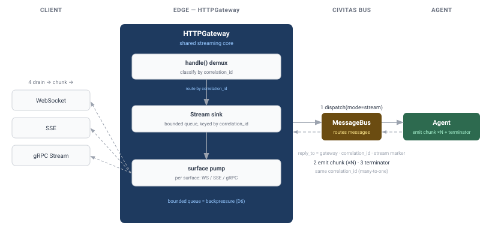
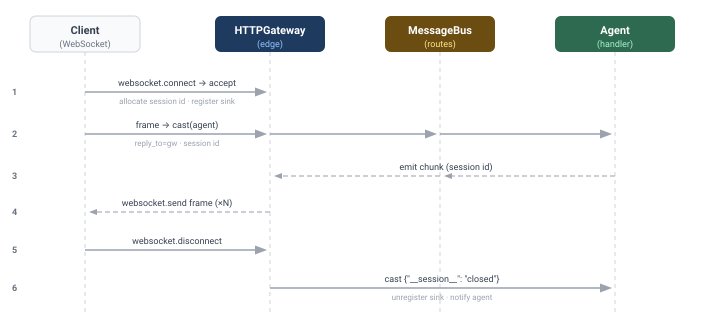
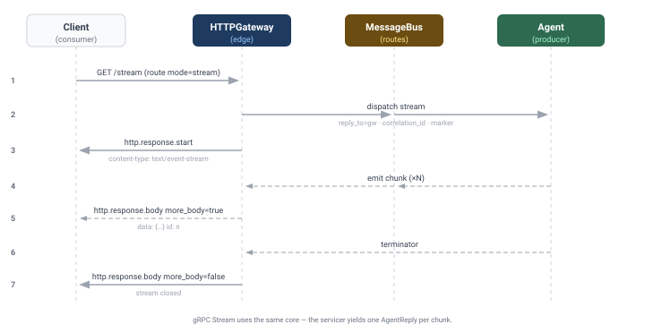

# Design: Gateway Streaming — WebSocket (G2) + SSE / true streaming (G3)

**Status:** DRAFT — for review (2026-07-04)
**Author:** Sisyphus
**Covers:** v0.6.0 milestones **G2** (WebSocket upgrade) and **G3** (SSE / true streaming responses),
and completes the **gRPC `Stream`** RPC that G1 deferred.

> **Guiding principle:** G2 and G3 are not two independent features — they are three client-facing
> shapes (WebSocket frames, SSE events, gRPC server-stream) over **one shared streaming core**. The
> G1 design already called this out ("build all three streaming surfaces together on one streaming
> core"). This doc designs that core first, then the three surfaces on top of it. Same gateway ethos
> as G1: the agent never sees the wire; the gateway owns every protocol concept.

This doc supersedes the streaming sketches in [`http-gateway.md`](http-gateway.md) Phase 4 and answers
[`gateway-api-surface.md`](gateway-api-surface.md) **Q4** (streaming was deferred with the
`{"chunks": [...]}` buffer-and-serialise workaround; G3 replaces it with real streaming).

---

## Motivation

Three gaps remain in the gateway after G1:

1. **No streaming responses.** A route can only `call` (one reply) or `cast` (no reply). An agent that
   produces output incrementally (token-by-token LLM output, progress events, tailing logs) must
   buffer everything into one `{"chunks": [...]}` reply — high latency, no progress, unbounded memory.
2. **No WebSocket.** `GatewayASGI.__call__` handles only `http` and `lifespan` scopes; a `websocket`
   upgrade is silently dropped. There is no way to hold a long-lived bidirectional session to an agent.
3. **gRPC `Stream` is a stub.** G1 shipped `Stream` in the `.proto` but the servicer returns
   `UNIMPLEMENTED` — deliberately deferred here.

All three need the same thing: **a way for an agent to emit a *sequence* of messages to a single
client connection, and for the gateway to forward that sequence over the wire until it ends.**

---

## Reconciliation with the shipped runtime (what exists in v0.5 / G1)

Grounding the design in current facts (confirmed by reading the code):

- **The bus has no streaming primitive.** `AgentProcess` exposes `send` (fire-and-forget), `ask`
  (single request→single reply), and `broadcast` (fire-and-forget fan-out). There is **no** `stream`,
  no pub/sub, no topic subscription. `Transport.subscribe`/`publish` exist but are internal wiring.
- **Request-reply correlation is fully built and proven.** `ask()` stamps a `correlation_id`; the
  transport allocates an ephemeral `reply_to = "_reply.{uuid}"` backed by a one-slot queue; the
  handler's `self.reply(payload)` echoes `correlation_id` and targets `reply_to`. **The streaming core
  generalises exactly this pattern from *one* reply to *many*.**
- **`HTTPGateway` is itself a registered `AgentProcess`** whose `handle()` is currently a no-op
  (`pass`). Agents can already `send()` to it by name. This is the hook the streaming core uses to
  receive chunks back.
- **`GatewayDispatcher` (D3 from G1) is the shared translate-and-route core** for HTTP and gRPC, with
  `dispatch(mode="call"|"cast")`. Streaming adds a third mode.
- **ASGI response path is single-shot.** `_respond()` sends one `http.response.start` + one
  `http.response.body` (no `more_body=True`). SSE needs an incremental variant.
- **WebSocket wire protocol is already available** — `uvicorn[standard]` bundles `websockets`. The
  ASGI *server* handles the handshake/framing; we only need to handle the `websocket` **scope** in our
  app. **No new dependency for G2.**

---

## Architecture — the shared streaming core



The core generalises request-reply into request-**stream**:

1. The gateway opens a **stream sink**: a bounded `asyncio.Queue` registered under a fresh
   `correlation_id` in a per-gateway `dict[str, StreamSink]`.
2. It dispatches the request to the agent as a normal bus message with `reply_to = <gateway name>`,
   the `correlation_id`, and a marker (`message_type = "*.stream"`) telling the agent a stream is
   expected.
3. The agent emits chunks back to the gateway over the bus (one message per chunk, same
   `correlation_id`), then a **terminator**. Because chunks are addressed to the gateway's own name,
   they land in the gateway's mailbox and flow through `handle()`.
4. `HTTPGateway.handle()` (no longer a no-op) demultiplexes by `correlation_id` and enqueues each chunk
   onto the matching sink; the terminator closes the sink.
5. The gateway surface (WebSocket / SSE / gRPC) consumes the sink as an `AsyncIterator[dict]` and
   writes each chunk to the wire. When the iterator ends (terminator, timeout, or client disconnect),
   the sink is unregistered.

This is deliberately **the same ephemeral-address + correlation_id mechanism that `ask()` already
uses** — just many-to-one instead of one-to-one, and demultiplexed in `handle()` instead of a
transport reply queue.

### D1 — Streaming core mechanism (the pivotal decision)

| Option | What it is | Cost / risk | Verdict |
|---|---|---|---|
| **A. Gateway-mediated correlation_id multiplexing** | Stream sinks live in the gateway; agent emits chunks back to the gateway by name; `handle()` demuxes by `correlation_id`. One small additive `AgentProcess` helper (`emit`/`end_stream`). **No transport/bus change.** | Backpressure is coarse (bounded queue + overflow policy, see D6); streaming is a gateway-scoped capability, not a general agent-to-agent one. | **✅ Recommended** |
| B. First-class bus streaming | Add `Transport.stream()` across in-process/ZMQ/NATS + `AgentProcess.stream()` returning `AsyncIterator[Message]`. Agents everywhere can stream. | Large surface across all transports; ZMQ/NATS multi-reply semantics are genuinely hard; destabilises the core for a gateway feature. A milestone of its own. | Rejected for v0.6.0 (revisit if agent-to-agent streaming becomes a first-class need) |
| C. Ephemeral sink agents | Register a throwaway receiver agent per stream in the registry; agent streams to it. | Requires dynamic registration of non-agent receivers + registry churn per request; more moving parts than A for no real gain. | Rejected |

**Recommendation: Option A.** It ships G2+G3 surgically, reuses the proven correlation_id/reply_to
pattern, adds no dependency and no transport-protocol change, and keeps streaming a *gateway* concern
(consistent with "all HTTP/protocol concerns live at the gateway boundary"). Option B is a legitimate
future ("bus-native streaming") but is out of proportion to a gateway-completion milestone.

### D2 — Agent-side streaming API

The agent needs a minimal, ergonomic way to emit a stream. Two shapes:

```python
# Option D2-a — explicit helpers (mirrors self.reply)
async def handle(self, message: Message) -> None:
    async for token in self.llm.stream(...):
        await self.emit(message, {"token": token})   # one chunk
    await self.end_stream(message)                    # terminator

# Option D2-b — async context manager (auto-terminates, exception-safe)
async def handle(self, message: Message) -> None:
    async with self.stream_reply(message) as stream:
        async for token in self.llm.stream(...):
            await stream.send({"token": token})
    # terminator (and error terminator on exception) sent automatically
```

**Recommendation: D2-b (context manager) as the primary API, with `emit`/`end_stream` as the
low-level primitives it's built on.** The context manager guarantees the terminator is always sent
(including on exception → an *error* terminator the client can see), which is the #1 correctness
footgun of manual streaming. Both are tiny, additive, and mirror the existing `self.reply()`
construction (recipient = `reply_to`, echo `correlation_id`). This is the **only** change outside the
gateway package, and it is purely additive to the public SDK.

`emit`/`end_stream`/`stream_reply` build a `Message` exactly like `reply()` does, but stamp a control
field (`payload["__stream__"] = "chunk" | "end" | "error"`) so `handle()` can classify without
guessing. `_agency.*`-reserved typing is respected (we use a payload marker, not a reserved type).

---

## G2 — WebSocket upgrade



A WebSocket is a **long-lived, bidirectional session** bound to one agent. Per the roadmap, inbound
frames map to `cast()` and the agent streams messages back over the same socket.

**Flow:**
1. `GatewayASGI.__call__` gains `elif scope["type"] == "websocket": await self._handle_websocket(...)`.
2. On `websocket.connect`, the gateway matches the path to a **ws route** (below), `accept`s the
   socket, allocates a **session id** (a long-lived `correlation_id`), and registers a session sink.
3. **Client → agent:** each `websocket.receive` frame (JSON) is dispatched `mode="cast"` to the route's
   agent, carrying `reply_to = <gateway>`, the session id, and the parsed payload. The agent handles it
   like any cast.
4. **Agent → client:** the agent emits chunks (via `emit`/`stream_reply`) tagged with the session id;
   `handle()` routes them to the session sink; a background pump task per socket drains the sink and
   `websocket.send`s each as a text frame.
5. On `websocket.disconnect` (or agent error terminator), the pump stops, the sink is unregistered, and
   the agent is notified with a `cast` (`{"__session__": "closed"}`) so it can release per-session
   state.

**Config — ws routes** (topology YAML, mirrors HTTP routes):

```yaml
config:
  ws_routes:
    - path: /ws/chat
      agent: assistant           # frames → cast(assistant); agent streams back
```

**Scope for G2:** WebSocket over HTTP/1.1 + HTTP/2 via uvicorn (the common case). WebSocket-over-HTTP/3
(the WebTransport/aioquic path) is **out of scope** — noted as future. SSE (G3) already covers the
HTTP/3 streaming case since it is plain chunked HTTP.

---

## G3 — SSE / true streaming (and gRPC `Stream`)



G3 turns the streaming core into **outbound-only** streams on the request/response surfaces.

### SSE (Server-Sent Events) over HTTP

- A route declares `mode: "stream"`. The terminal dispatch uses the streaming core (not `call`).
- A new `_respond_stream()` sends `http.response.start` with `content-type: text/event-stream` and
  **no `content-length`**, then, per chunk, `http.response.body` with `more_body=True`, formatting each
  as an SSE event:
  ```
  id: 7
  data: {"token": "Hel"}

  ```
  The terminator sends a final `http.response.body` with `more_body=False`. Errors emit an
  `event: error` frame before closing.
- This **replaces the `{"chunks": [...]}` workaround** (Q4): the agent emits chunks incrementally
  instead of buffering them into one reply.
- Works across HTTP/1.1, HTTP/2, and HTTP/3 (it is ordinary chunked HTTP).

### gRPC server-streaming (`Stream`)

- The G1 `Stream` stub is completed: `_AgentServicer.Stream` calls the streaming core and `yield`s one
  `AgentReply(payload=Struct)` per chunk, ending when the core iterator ends. Error terminators map to
  the same D6 gRPC codes as G1 (transport failures → status codes; agent error terminator → an
  `AgentReply.error` before the stream closes, consistent with G1's in-band decision).

### D5 — SSE reconnection

Emit a monotonically increasing `id:` per event. On reconnect, the browser sends `Last-Event-ID`.
**Recommendation: best-effort for v0.6.0** — the gateway forwards `Last-Event-ID` to the agent in the
initial payload; *replay of missed events is the agent's responsibility* (the gateway keeps no per-
stream history). Durable replay is a non-goal (would require gateway-side buffering / a store).

---

## Config additions (`GatewayConfig`)

```python
ws_routes: list[dict[str, Any]] = field(default_factory=list)   # WebSocket routes (G2)
stream_queue_maxsize: int = 256      # per-stream sink bound (backpressure, D6)
stream_idle_timeout: float = 300.0   # close a stream with no chunk for this long
max_stream_duration: float = 3600.0  # hard cap on a single stream/session
```

HTTP SSE routes reuse the existing `routes:` block with `mode: "stream"` — no new route config needed
for SSE, only for WebSocket.

---

## D6 — Backpressure & lifecycle

- Each sink is a **bounded** `asyncio.Queue(maxsize=stream_queue_maxsize)`. `handle()` enqueues with
  `put_nowait`; **on overflow the stream is closed with a `slow_consumer` error terminator** rather
  than blocking the gateway message loop (blocking `handle()` would stall *all* streams). Rationale:
  in Option A the bus is fire-and-forget, so we cannot push backpressure to the agent; failing fast on
  a slow client is the honest behaviour. Configurable queue size lets deployments tune the tolerance.
- **Timeouts:** `stream_idle_timeout` (no chunk) and `max_stream_duration` (total) both close the sink
  and, for WS, the socket. Prevents zombie streams from leaking sinks/sockets.
- **Client disconnect** (SSE connection dropped / WS closed): the surface cancels its pump, unregisters
  the sink, and casts a close notice to the agent so it can stop producing.
- **Gateway shutdown** (`on_stop`): all sinks are closed, pumps cancelled, sockets closed with a
  going-away code.

---

## Testing plan

- **Streaming core (unit):** sink register/enqueue/terminate/overflow/timeout; `handle()` demux by
  correlation_id; `emit`/`end_stream`/`stream_reply` message shape (recipient/correlation/marker);
  context-manager terminator-on-exception.
- **G2 (unit + integration):** drive `GatewayASGI` with a synthetic `websocket` scope
  (connect/receive/send/disconnect); frame→cast; agent-emitted chunk→frame; disconnect→agent notice;
  idle/duration timeout.
- **G3 SSE (unit + integration):** `mode: "stream"` route → `text/event-stream`, `more_body` chunk
  sequence, `data:`/`id:` framing, error frame, replaces `{"chunks"}`; real HTTP client reads the
  event stream.
- **gRPC `Stream` (integration):** real `grpc.aio` channel, `AgentStub.Stream` yields N replies then
  completes; agent error terminator surfaces on the last reply.
- Coverage ≥ 85% gate held; generated proto stays omitted.

---

## Decisions summary (need sign-off)

| # | Decision | Recommendation |
|---|---|---|
| D1 | Streaming core mechanism | **A — gateway-mediated correlation_id multiplexing** (no transport change) |
| D2 | Agent-side streaming API | **`async with self.stream_reply(msg)`** primary; `emit`/`end_stream` low-level |
| D3 | WebSocket wire library | **Reuse `uvicorn[standard]`'s `websockets`** — no new dependency |
| D4 | WS client→agent semantics | Each frame → **`cast()`** (per roadmap); agent streams back on the same socket |
| D5 | SSE reconnection | **Best-effort** (`id:` + forward `Last-Event-ID`); durable replay is a non-goal |
| D6 | Backpressure | **Bounded sink; close with `slow_consumer` on overflow**; idle + duration timeouts |
| D7 | Doc/route config | SSE via existing `routes:` `mode: "stream"`; WebSocket via new `ws_routes:` |

---

## Non-goals (v0.6.0)

- Bus-native agent-to-agent streaming (Option B) — separate future initiative.
- Durable SSE replay / event history (agent's responsibility if needed).
- WebSocket over HTTP/3 / WebTransport (uvicorn HTTP/1.1+2 path only for G2).
- gRPC client-streaming and bidirectional streaming (server-streaming only; matches G1 non-goals).
- Per-message auth handshakes beyond the existing middleware chain (auth middleware is G5).

---

## Implementation checklist (on approval)

Order minimises risk — the shared core lands first with its own tests, then each surface:

1. **Streaming core:** `AgentProcess.emit` / `end_stream` / `stream_reply` (additive); `StreamSink` +
   registry on `HTTPGateway`; wire `HTTPGateway.handle()` to demux; `GatewayDispatcher.stream()` /
   `mode="stream"` returning `AsyncIterator[dict]`. Unit tests.
2. **G3 SSE:** `_respond_stream()` in `asgi.py`; `mode: "stream"` route handling; error/`id:` framing.
   Unit + integration tests.
3. **G3 gRPC `Stream`:** complete `_AgentServicer.Stream` on the core. Integration test.
4. **G2 WebSocket:** `_handle_websocket()` + `websocket` scope branch; `ws_routes` config; per-socket
   pump + session sink; disconnect/timeout handling. Unit + integration tests.
5. **Config + docs:** `GatewayConfig` fields; topology validate/show for `ws_routes`; CHANGELOG;
   flip milestones G2/G3 to done; update the (now-stale-again) `http-gateway-arch.svg` note if needed.
6. Full gate (ruff + mypy + pytest + coverage), strip `uv.lock` artifact, commit.
