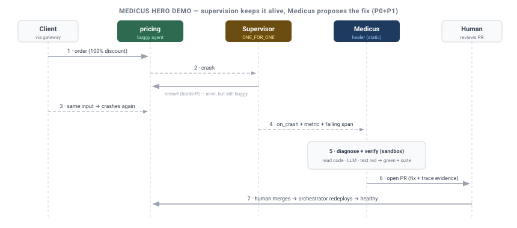

# Design: Medicus — Self-Healing Hero Demo

**Status:** DRAFT — for review. Reference demo for the self-healing initiative ([`self-healing.md`](self-healing.md)).
**Author:** Sisyphus
**Date:** 2026-07-04
**Scope:** demonstrates **P0 + P1 only** (detect → diagnose → sandbox-verified **PR**). *Not* autonomous
deploy — see the honest-framing note below.

> **The headline:** *"The runtime that keeps your agents alive — and now proposes the permanent fix."*
> A supervised app hits a real bug. Supervision keeps it running; **Medicus** watches the telemetry,
> reads the code, reproduces the failure as a test, verifies a fix in a sandbox, and opens a PR — every
> step traced and audited. It is the one demo that only a *runtime* (not an agent framework) can tell.

---

## Why this replaces the Personal Assistant demo

The Telegram personal-assistant demo (deferred §M1.8) is a generic "agent framework" showcase —
LangGraph/CrewAI do the same, so it sells nothing unique — and it is blocked on unbuilt pieces (a
Telegram gateway + the deferred Skills Gateway in civitas-contrib). Medicus instead showcases
Civitas's actual moat — **supervision + observability (metrics/audit/OTEL) + dynamic lifecycle +
fault-tolerance** — and it dogfoods the whole stack shipped through v0.6.0 (gateway, streaming,
supervision). The Telegram assistant survives as a *minor* gateway+skills sample later, not the hero.

## Honest framing (so it's a win, not an overclaim)

- **Copilot, not autonomy.** The demo ends at a **PR a human merges** (P0+P1). It does **not** stage
  the autonomous deploy loop (P2+), which carries the caveats Oracle flagged in `self-healing.md`.
- **Reproducible, not live-LLM roulette.** The scenario uses a **seeded, known bug**; the offline path
  uses a **mock LLM** with a canned diagnosis so the demo is deterministic on stage. A live LLM is an
  optional flag, never the default for a recorded/keynote run.
- **Prerequisite:** a Medicus needs its own audit trail + metrics, so it runs as a **static supervised
  child** (side-stepping the dynamic-spawn wiring gap noted in `self-healing.md` must-fix #6).

---

## The scenario

A small supervised "orders" topology behind the HTTP gateway:

- `gateway` (HTTPGateway) → `pricing` (buggy) + `inventory` + `orders` agents, under a `root`
  supervisor (`ONE_FOR_ONE`), with a persistent `StateStore`, OTEL console exporter, and an audit sink.
- **The seeded bug:** `pricing` raises on one specific input — e.g. a `KeyError`/`ZeroDivisionError`
  on a `100%` discount code (a plausible off-by-one / missing-guard bug). Normal traffic is fine.
- **`medicus`** — a static supervised child running the P0+P1 loop, with read access to the repo and a
  sandbox for verification.

**The teaching beat:** when the bad input arrives, `pricing` crashes and the **supervisor restarts it**
(the app never fully dies) — but it **keeps crashing on that input**, because *supervision keeps you
alive, it does not fix logic bugs.* That gap is exactly what Medicus closes.

## Storyboard (~2 minutes)

| Beat | On screen | Shows off |
|---|---|---|
| 1 | Normal orders flow through the gateway; OTEL trace scrolls | Gateway + tracing + multi-agent routing |
| 2 | A `100%`-discount order hits `pricing` → it crashes → **supervisor restarts it** | Supervision + backoff (fault-tolerance) |
| 3 | The same input recurs → error-rate spike on `pricing`; restart budget ticking | Metrics + the honest limit of restart-only |
| 4 | **Medicus** fires on `on_crash` + the metric + the failing OTEL span/audit record | Observability as first-class *input* |
| 5 | Medicus reads the traceback + `pricing` source, asks the LLM for the root cause + minimal fix | LLM reasoning over real telemetry + code |
| 6 | Medicus writes a test **from the real failing input**, runs it in a **sandbox**: red → applies fix → green + full suite | Verification anchored to reality (D8) |
| 7 | Medicus **opens a PR** with the diff, the trace evidence, and its reasoning — its own steps fully OTEL-traced + audited | The copilot payoff + immutable audit |
| 8 | Human merges → orchestrator redeploys → `100%`-discount order now succeeds | Reversible, human-gated deploy (D1/D4) |

**Punchline:** *"The supervisor kept it running. Medicus found the root cause, proved the fix, and
opened the PR — with a full audit trail. A human clicked merge."*

## Architecture (demo realization of P0+P1)

- **Reuses, doesn't rebuild:** the existing runtime, gateway, supervision, `on_crash`, metrics, audit,
  and OTEL — no new core is required for the demo itself.
- **Medicus agent** (in `examples/` or a `civitas-contrib`/`medicus` package, not `civitas/` core):
  the deterministic controller + the diagnosis step (LLM) driven **only by typed signals** (D9).
- **Tools** (≈4 small `ToolProvider`s, sandbox-scoped): `read_file`, `run_tests`, `write_file`,
  `open_pr` (git) — or MCP filesystem/bash servers.
- **Sandbox:** fabrica bubblewrap with the repo mounted; healer/CI paths **read-only** (D-Q5).
- **LLM:** mock provider (canned diagnosis for the seeded bug) by default; `--live` flag for a real
  provider.

## Build plan

1. `examples/self_healing/app/` — the seeded orders topology (buggy `pricing`) + `topology.yaml`.
2. `examples/self_healing/medicus.py` — the P0+P1 agent (controller + diagnose + verify + PR), static
   child in the topology.
3. The 4 sandbox-scoped tools + a mock LLM with the canned diagnosis.
4. `examples/self_healing/README.md` + a `run.sh` that drives the exact storyboard (offline by
   default, `--live` optional).
5. A short recorded walkthrough (OTEL trace + the resulting PR) for the docs site.

## Prerequisites & dependencies

- Medicus runs as a **static child** (avoids the dynamic-spawn audit/metrics gap; fixing that gap is
  still tracked separately).
- fabrica for the sandbox (`fabrica-context`); degrades to a subprocess-with-tmpdir for the offline demo.
- No new core dependency; LLM via existing `civitas-contrib` providers (mock for the default run).

## Success criteria

- [ ] `run.sh` reproduces beats 1–8 deterministically offline (mock LLM), on a clean checkout.
- [ ] `pricing` crashes on the seeded input and the supervisor restarts it (visible in OTEL/metrics).
- [ ] Medicus produces a **real diff** that turns a **real reproducing test** red → green + full suite.
- [ ] Medicus opens a PR (or writes a patch + PR body) with trace evidence; every Medicus action is in
      the audit trail.
- [ ] Nothing auto-deploys; the merge + redeploy is explicitly human/orchestrator-driven.
- [ ] `--live` runs the same flow against a real LLM.

## Relationship to other artifacts

- **`self-healing.md`** — the architecture/feasibility + safety design; this doc is its **P0+P1
  reference demo**. All framing (staged autonomy, safety floor, D1 orchestrator-first) is inherited.
- **`examples/research_assistant.py`** — kept as the "multi-agent orchestration" example; Medicus is
  the "self-healing runtime" flagship.

## Non-goals (demo)

- No autonomous deploy / rollback on stage (P2+ is out of the demo).
- No arbitrary-bug fixing claim — the demo is a seeded, bounded scenario.
- No Telegram/personal-assistant surface.
