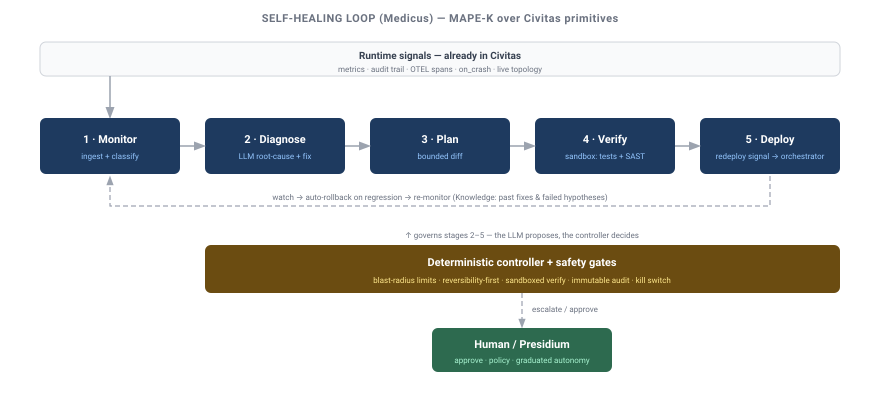
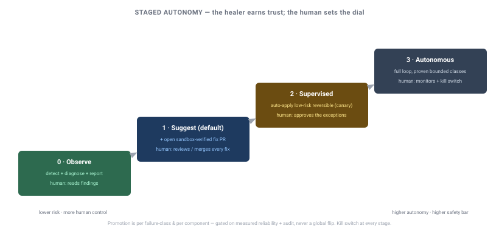

# Design: Self-Healing / Autonomous Remediation

**Status:** DRAFT — Oracle-reviewed 2026-07-04, revised per critique. Not approved; build P0–P1 only when greenlit.
**Author:** Sisyphus
**Date:** 2026-07-04
**Verdict (Oracle):** feasible-with-caveats as an SRE copilot (P0–P1); the deploy primitive is
**orchestrator-first**, in-runtime canary deferred. See "Oracle review" below.
**Reference demo:** [`medicus-demo.md`](medicus-demo.md) — the P0+P1 hero demo (detect → diagnose → verified PR).

> **One-line framing:** Civitas already gives agents *fault-tolerance* (crash → supervised restart).
> Self-healing extends that from "restart the same code" to "diagnose the fault, propose a code fix,
> verify it in a sandbox, and roll it out safely" — under **staged autonomy** with a human able to set
> exactly how much the system may do on its own. This is an SRE-agent capability layered on the
> runtime, **not** Erlang-style in-place hot code loading (which Python cannot do safely).

---

## Oracle review — verdict & required revisions (2026-07-04)

Oracle pressure-tested this design against the runtime code. **Verdict: feasible-with-caveats as an SRE
copilot (P0–P1); *not as described* for the deploy primitive (D1/P2).** Detect → diagnose →
sandboxed-verified PR is buildable on existing seams; the "blue-green worker restart" primitive was
wishful and is reframed here. **This section supersedes any conflicting canary/blue-green framing
below.**

**D1 reframed — no in-runtime code swap, no overlapping canary:**
- In-process reload is impossible — every class load is `importlib.import_module` → `sys.modules` cache
  (`supervisor.py:588`); restart reuses the *same instance* (`supervisor.py:332-348`). New code exists
  only in a **new OS process**.
- The registry forbids two same-named instances (`registry.py:119-120,191-195`) and the runtime
  silently swallows the collision (`runtime.py:712-713`) → **no overlapping canary**; today's reality
  is **stop-then-start (brief downtime)**.
- Worker restart **drops in-flight mailbox messages** (`process.py:977`, `worker.py:202`), reply
  routing breaks mid-cutover, retries aren't idempotent, and cross-process state continuity **requires
  a shared durable store** (default is in-memory, `state.py:33`).
- **Resolution (Q1):** deploy is **orchestrator-first** — civitas emits a typed `redeploy vX` request +
  best-effort drain; k8s/systemd does the rollout + health-check + rollback. In-runtime canary
  (versioned names + alias routing) is a **large separate primitive, deferred / cut from v1**.

**Safety hardened (was necessary-but-naive):**
- **Verification anchored to reality (D8):** the failing test must be **derived from the real signal**
  (reproduce the actual crash/trace/input) — an LLM-authored test proves nothing. Require the **full
  existing suite + coverage on changed lines**. Restrict auto-deploy to **crash-class** faults until a
  correctness signal (golden output / shadow compare) exists — canary metrics are error/latency-only
  (`metrics.py:17-30`), blind to silent wrong-output regressions.
- **Injection is structural (D9):** the deterministic controller **never lets free-text telemetry
  authorize a transition** — only typed/signed signals drive the machine; logs/traces/audit text are
  *evidence for humans*, not control input (telemetry is attacker-influenceable, `bus.py:105-120`).
- **Self-guardrail isolation enforced, not prompted (Q5):** healer/governance/CI paths mounted
  **read-only** (`sandbox/config.py:18-23`) **plus** a deploy-gate that refuses diffs touching them;
  Medicus's own supervision isolated so a bad self-fix can't disable the healer or its kill switch.
- **Deploy/fix circuit breaker (D10, core):** global fix-rate limit + auto-freeze-on-regression +
  kill-switch-to-known-good. Restart budgets today are per-crash only (`supervisor.py:270-293`).

**Boundary corrected (D2):** the **safety floor** (kill switch, protected-path refusal, circuit
breaker) is **runtime safety and ships in core/contrib** — OSS is safe-by-default *without* Presidium.
The governance seams already exist (`on_spawn_requested`, `Registry.add_listener`, suspend/resume,
audit), so the minimal built-in gate needs no Presidium dependency; Presidium adds policy richness on
top.

**Phasing re-sized:** insert a **shadow stage** (generate + verify a fix, measure precision, no PR)
between P0 and P1; **split P2** into P2a = orchestrator rollout + health-check + auto-rollback (cheap,
standard) and ~~P2b = in-runtime canary~~ **cut from v1**.

### Must-fix before build-ready
1. D1 / Q1 reframed orchestrator-first (done above).
2. Drop overlapping canary for v1 — accept brief downtime + orchestrator rollback.
3. Verification anchored to the real signal + full suite + coverage-on-diff; auto-deploy crash-class only.
4. Structural guardrail isolation — read-only mounts + deploy-gate refusing healer/governance/CI diffs.
5. Deploy/fix circuit breaker + kill-switch-to-known-good in core (Presidium-independent).
6. **Runtime bug to fix first:** `DynamicSupervisor._handle_spawn` wires deps but **omits `_audit_sink`
   and `_metrics`** (`supervisor.py:598-606` vs `components.py:84-93`) — a dynamically-spawned Medicus
   would run with **no audit trail or metrics**. Fix the wiring, or mandate Medicus be a *static* child.

**Build recommendation:** ship **P0 (observe) + P1 (suggest → verified PR) only** for now — ~80% of the
value at ~20% of the risk, mostly on existing primitives. Gate P2+ hard.

---

## Motivation

The customer ask: an agent that watches logs / traffic / audit trail / OTEL, has access to the
codebase, detects bugs, raises fixes, deploys them, and reloads the affected component — "something
Erlang OTP does."

Civitas is unusually well-positioned for the *runtime* half of this: it is an OTP-inspired
supervision runtime with first-class observability and dynamic process control. The gap is the
**closed loop** (detect → diagnose → fix → verify → deploy → rollback) and, above all, the **safety
envelope** that makes autonomous code changes responsible rather than reckless.

---

## Reconciliation with what exists (honest inventory)

**We do NOT have hot code reload today.** `grep` for `reload|hot.?swap|code_change|importlib.reload`
across `civitas/` returns zero matches; supervisor restart *reuses the same instance* and never
re-imports the class; deploying fixed code means **rebuild image + restart process**.

What already exists — the OTP-shaped skeleton the loop builds on:

| Capability | Where | Use in self-healing |
|---|---|---|
| Supervision: crash → restart (ONE_FOR_ONE/ALL/REST, backoff) | `supervisor.py` | Baseline fault-tolerance; restart budget = a failure signal |
| `runtime.on_crash(cb)` → `(agent_name, exc)` | `runtime.py` | **Detect** crashes (push) |
| Metrics (`MetricsSink` push, `MetricsCollector.snapshot` pull) | `observability/metrics.py`, `dashboard/collector.py` | **Monitor** latency/error/throughput |
| Audit trail (`AuditSink`, `message.route` on every message) | `audit/` | **Monitor** behavior; **immutable audit** for the loop |
| OTEL spans (`send`/`recv`/`handle`/`llm`/`tool`/`supervisor.restart`) | `observability/tracer.py` | **Monitor/diagnose** traces |
| Live topology API (HTTP) | `topology_server.py` | **Monitor** agent health (pull) |
| Dynamic spawn/despawn/stop | `supervisor.py`, `process.py`, `runtime.py` | **Deploy** via new instance; drain old |
| Durable state (`checkpoint()` + `StateStore`) | `process.py`, `plugins/state.py` | **State continuity** across restart |
| `self.llm.chat(tools=…)` | `plugins/model.py` | **Diagnose** + generate fix |
| Tools / MCP / sandbox config | `plugins/tools.py`, `process.py connect_mcp`, `sandbox/` | **Fix** (read/write/test/git); sandbox via fabrica bubblewrap |

Every monitoring signal is consumable by an ordinary `AgentProcess` **without monkey-patching**.

---

## The hard truth about "reload" (OTP vs Python) — decides D1

Erlang/OTP hot code upgrade (two-version code, `gen_server:code_change/3` state migration,
`sys:suspend → change_code → resume`, fully-qualified-call switching) is a **BEAM VM** feature. Python
has no safe equivalent:

- `importlib.reload()` is fundamentally unreliable — existing instances keep the old class, `from x
  import y` aliases don't update, C-extensions break, and running coroutines keep old code (per the
  CPython docs and jurigged/reloadium's own caveats).
- **Every** production Python framework (uvicorn `--reload`, Django, Gunicorn `HUP`) reloads by **full
  process restart**, never in-place swap.

**Therefore the "reload the affected component" step = spawn-new-process + drain + retire-old**
(blue-green at the worker/process level). This is not a downgrade of the OTP idea — it is the *same*
supervisor-restarts-child-with-new-code pattern, at **process granularity** instead of module
granularity. It maps cleanly onto Civitas's worker + supervision model.

---

## Architecture — the self-healing loop

A MAPE-K loop (Monitor → Analyze → Plan → Execute → Knowledge), run by a dedicated **healer agent**
(working name **Medicus**), with a **deterministic controller** wrapping the LLM (the LLM proposes;
the controller decides — see D5):

1. **Monitor** — subscribe to the signals above (metrics/audit/OTEL/on_crash) + poll topology. Feed a
   rolling window into a **failure classifier**.
2. **Analyze / Diagnose** — on a qualifying signal, gather evidence (failing trace, stack, correlated
   logs, the offending code via a filesystem tool) and ask the LLM for a root-cause hypothesis +
   candidate fix. Screen all tool/telemetry inputs for prompt injection first.
3. **Plan** — produce a bounded change: a minimal diff within blast-radius limits, plus the
   verification it must pass. Classify reversibility.
4. **Verify** — apply the diff in an **isolated sandbox** (fabrica bubblewrap / ephemeral worker), run
   the affected tests + static analysis. Fail → rollback snapshot, retry with budget, else escalate.
5. **Execute / Deploy** — per the autonomy stage (below): open a PR (default), or canary-deploy via a
   **new worker with the fixed code** and drain the old one, watching health.
6. **Rollback / Verify-in-prod** — automatic rollback on health/metric regression; post-hoc watch for
   recurrence; write the outcome (and failed hypotheses) back to Knowledge.

### Where each piece lives (D2 — respects `boundary.md`)

- **civitas (core):** the monitoring surfaces (exist), a new **`restart-with-new-code` worker
  primitive** (blue-green drain), dynamic spawn/despawn, sandbox config, and a generic
  **remediation/health hook**. Runtime only — no LLM, no policy.
- **civitas-contrib (or a new `medicus` package):** the healer agent + code-fix tools
  (filesystem/subprocess/git) + failure classifier. Application-level, depends on core.
- **presidium (governance):** approval gates, fix-policy (what may be changed), budgets, and
  **graduated-autonomy enforcement** + audit. The safety envelope is a *governance* concern, exactly
  Presidium's role. A minimal built-in gate ships for OSS users without Presidium (see Q4).

---

## Staged autonomy model (D3)

Autonomy is a **dial**, defaulting to the safest useful setting. A component earns higher autonomy only
after proven behavior:

| Stage | What the healer may do | Human role |
|---|---|---|
| **0 · Observe** | Detect + diagnose + report (no changes) | Reads findings |
| **1 · Suggest** *(default)* | Everything in Observe + open a **fix PR** (sandbox-verified) | Reviews/merges every fix |
| **2 · Supervised** | Auto-apply **low-risk, reversible** fixes via canary; **HITL** for anything else | Approves the exceptions; watches |
| **3 · Autonomous** | Full loop for **proven, bounded** failure classes; canary + auto-rollback | Monitors dashboards; kill switch |

Progression is per-failure-class and per-component, gated on metrics + audit review — never a global
flip.

---

## Safety controls (non-negotiable — from AIOps prior art)

Reversibility beats approval clicks for high-consequence, short-window actions; humans review the rare
irreversible ones. Tiered:

- **Structural:** sandboxed validation; **canary + automatic rollback** (reversible actions);
  blast-radius limits (max diff, **no new dependencies**, no schema/migration auto-apply, protected
  paths); immutable audit; **kill switch** that leaves a known-good state.
- **Control-flow (D5):** a **deterministic state machine**, not the LLM, owns the critical path
  (auto-apply-if-generated, auto-commit-if-tests-pass, force-progress after N reads, bounded retries).
  Reliability of comparable systems jumped ~10%→90% precisely by taking the LLM *out* of control.
- **Classification (D6):** escalate — do **not** auto-fix — infrastructure/resource failures (a real
  cautionary case: bumping memory weekly instead of fixing a leak), security-policy changes, and
  anything without a clear reproduction + a test that goes red→green.
- **Oversight:** confidence + risk routing to an approval queue (HMAC-locked payloads); maker-checker
  for irreversible actions; a separate reviewer/classifier that only sees user-intent + tool calls
  (defends against the agent talking itself into a bad action); **prompt-injection screening** of
  telemetry/tool outputs before they enter the healer's context.

---

## New primitives to build (the gaps)

1. **`restart-with-new-code` (core)** — a worker-level blue-green swap: start a fresh worker importing
   the new code, drain/hand-off, retire the old. This is the only genuinely missing *runtime* piece.
2. **Code-fix toolset (contrib)** — `read_file` / `write_file` / `run_command` / `git` tools (≈4 small
   `ToolProvider`s) or MCP filesystem/bash servers, executed under sandbox.
3. **Failure classifier (contrib)** — maps a signal to {logic-bug (remediable) | infra/resource
   (escalate) | security (escalate) | flaky (observe)}.
4. **Canary + auto-rollback controller (core/contrib)** — health-watch + revert.
5. **Governance hooks (presidium)** — policy + approval + graduated-autonomy enforcement + audit.

---

## Decisions

| # | Decision | Resolution |
|---|---|---|
| D1 | Deploy / "reload" mechanism | **Orchestrator-first new-process deploy** — emit a typed `redeploy vX` signal + best-effort drain; k8s/systemd rolls out + health-checks + rolls back. *No* in-place reload (Python) and *no* in-runtime overlapping canary in v1 (registry is 1-name→1-address). |
| D2 | Component boundaries | Runtime + primitive in **core**; healer agent + tools in **contrib**; governance/approval in **presidium** (minimal built-in gate for OSS). |
| D3 | Autonomy | **Staged** (Observe → Suggest → Supervised → Autonomous); default **Suggest** (PR + HITL). Per class/component. |
| D4 | Deploy safety | **Reversibility-first**: orchestrator rollout + health-check + **auto-rollback**; maker-checker only for irreversible ops. Auto-deploy restricted to **crash-class** faults until a correctness signal exists. |
| D5 | Control loop | **Deterministic state machine** wraps the LLM; LLM proposes, controller decides; bounded retries + anti-loop. |
| D6 | Scope of auto-fix | **Logic bugs with a red→green test only.** Escalate infra/resource/security. |
| D7 | Verification | Sandboxed test + static-analysis gate before any deploy (see D8 for anchoring). |
| D8 | Verification anchoring | Failing test **derived from the real signal** (reproduce actual crash/trace/input) + full suite + **coverage on changed lines**. LLM-authored-only tests are insufficient. |
| D9 | Injection defense | Deterministic controller transitions **only on typed/signed signals**; free-text telemetry is human evidence, never control input. |
| D10 | Safety-floor location | Kill switch, protected-path deploy-gate, and fix/deploy **circuit breaker** ship in **core/contrib** (OSS safe-by-default); Presidium adds policy richness. |

## Open questions

- **Q1** — Does `restart-with-new-code` live in core (single-deployment blue-green) or defer to the
  orchestrator (k8s rolling update)? Proposed: a thin core primitive **and** a documented orchestrator
  path for clustered deployments.
- **Q2** — Name: **Medicus** (Latin *physician*, fits Civitas/Presidium/Fabrica) vs plain
  `SelfHealingAgent`.
- **Q3** — Default fix output per stage: PR-only (Suggest) → canary (Supervised) → auto (Autonomous).
- **Q4** — Minimum viable governance for OSS users without Presidium (a built-in HITL gate + audit),
  vs full policy via Presidium.
- **Q5** — Should Medicus itself be supervised/sandboxed so a broken healer can't cascade (it must not
  be able to "fix" or disable its own guardrails)?

## Non-goals

- True OTP in-place module hot-swap / `code_change/3` live migration.
- Auto-remediating infrastructure, resource, or security-policy issues (always escalate).
- Auto-applying database migrations or other irreversible operations.
- Multi-service refactors or dependency changes without human sign-off.

## Implementation phases (staged, safety-first)

- **P0 — Observe:** monitoring adapters + failure classifier; detect + report only. Zero risk;
  validates detection precision (which gates everything downstream).
- **P0.5 — Shadow:** generate + sandbox-verify a fix but **do not** open a PR — measure fix precision
  before humans get PR spam.
- **P1 — Suggest:** diagnose + reproduce-from-real-signal + sandboxed verify (full suite +
  coverage-on-diff) → **PR** (HITL). The code-fix toolset + verification gate. **← smallest safe build (P0+P1).**
- **P2a — Deploy (orchestrator):** emit a typed `redeploy vX` signal + best-effort drain; k8s/systemd
  does the rollout + health-check + **auto-rollback**. Plus the core safety floor (protected-path
  deploy-gate, fix/deploy circuit breaker, kill switch).
- **~~P2b — in-runtime canary~~ (cut from v1):** versioned names + alias routing is a large
  distributed-systems primitive; defer until there is a real need.
- **P3 — Supervised:** auto-apply low-risk **crash-class** reversible fixes behind policy + graduated
  autonomy.
- **P4 — Autonomous (bounded):** proven failure classes only, with kill switch + post-hoc validation.

Each phase is independently shippable and gated on the previous phase's measured reliability.
